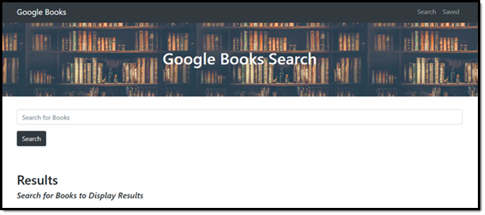
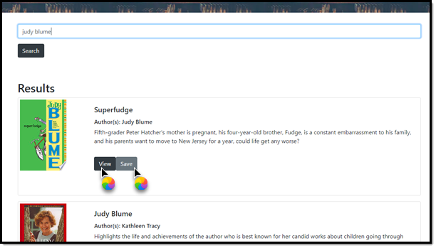
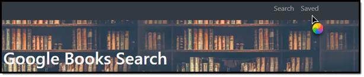
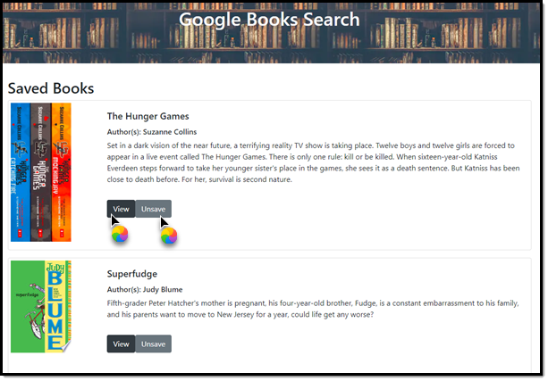

# Google Books Search

### Unit 21 MERN Homework: Google Books Search

### User Story
* AS AN avid reader
* I WANT to search for books and save selected titles to my library
* SO THAT I can read them later

## Description
For this assignment, I was tasked to create a React-based Google Books Search app. This assignment required me to create React components, work with helper/util functions, and utilize React lifecycle methods to query and display books based on user searches. I also used Node, Express and MongoDB so that users can save books to review or purchase later.

Access the deployed Heroku app here: https://react-google-book-search-clb20.herokuapp.com/

Access the git repo here: https://github.com/cbayley-edu/react-google-book-search


## Table of Contents 

* [Installation](#installation)
* [Usage](#usage)
* [License](#license)
* [Questions](#questions)

## Installation 

Since this is hosted on Heroku, there is no installation required however, if you want to clone or fork my github repo, feel free to do so. You will need to run a few commands in the terminal:
* npm i  
* npm run build
* npm start  (this application is built to run locally on port 3000, which can be changed in server.js)

You can also build your own vanilla React app by running ```npx create-react-app APP_NAME``` in your terminal. (Replace APP_NAME with your app name.)

## Usage

Access the application here: https://react-google-book-search-clb20.herokuapp.com/

Welcome to the Google API Books Search!



Use the search box to search to search for any book title or author. The results will display. You can click on the View button to view more information about the book or click on Save to save it for later.



To view your Saved books, click on the Saved link in the Navbar.



From the Saved Books page, you can also view more information about the book or click Unsave to remove it from your saved books.




## License 

[](https://opensource.org/licenses/MIT)

This project is covered by the above license(s). Click on the badge for more information.


## Questions 

GitHub username: cbayley-edu
GitHub profile link: https://github.com/cbayley-edu

Please email me at christinabayley@comcast.net with any questions you have or any issues you come across.

